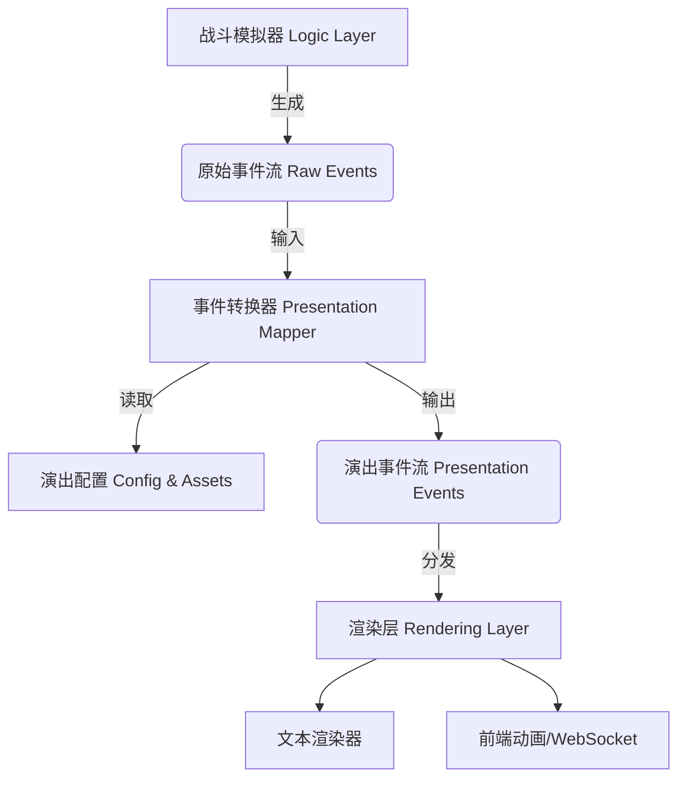

# 战斗演出系统终极设计文档 (Master Combat Presentation Design)

> **版本**: 2.0 (整合架构与资源)
> **状态**: 核心细节完备 (Implementation Ready)
> **目标**: 指导开发一套**事件驱动、配置导向**的战斗演出系统，实现逻辑与表现的完全解耦，同时保证高沉浸感的"小说式"叙事体验。

---

## 1. 设计概述 (Design Overview)

### 1.1 核心理念：沉浸式小说叙事
本系统摒弃传统的机械式日志，采用**"标准四段式"**的小说叙事风格。每回合战斗被封装为一个带有起承转合的微型故事，单回合字数控制在 100-150 字。

### 1.2 标准四段式结构
每一个战斗回合（Round）的演出严格遵循以下四行结构：

| 行号   | 此段类型                | 内容定义                                                                           | 数据来源             |
| :----- | :---------------------- | :--------------------------------------------------------------------------------- | :------------------- |
| **L1** | **环境/先手 (Context)** | 描述交战距离的变化、双方态势、以及**先手权的归属与原因**。                         | `RoundStartEvent`    |
| **L2** | **先攻行动 (Action A)** | 描述先手方的攻击动作及后手方的防御反馈（命中/躲闪/招架等）。                       | `AttackEvent (A->B)` |
| **L3** | **后手反击 (Action B)** | 描述后手方的反击动作（若满足条件）及先手方的防御反馈。若触发[战术脱离]则在此体现。 | `AttackEvent (B->A)` |
| **L4** | **回合总结 (Summary)**  | 描述本回合造成的战局影响、机体状态变化或战斗终结。                                 | `RoundEndEvent`      |

### 1.3 示例 (最终渲染效果)
> **ROUND 3**
> - **[环境]** 两台机体已近得能看清对方驾驶舱的红色独眼，1200m——这是刀与火的领域。高达抢回主动权，率先出击。
> - **[先手]** 光束军刀从腰部挂架中抽出的刹那，机体已化作白色闪光！刀刃精准刺向扎古背部的推进器喷口，炸开一团耀眼的电弧。（命中！伤害 1200）
> - **[反击]** 扎古在损伤中强行扭转机体，热能斧划出赤红的弧线——但因角度偏差，斧刃只是从高达肩甲边缘擦过，未能造成实质伤害。（未命中！伤害 0）
> - **[总结]** 金属撞击的震荡波在通讯频段中回响，两台受损的机体错身而过，留下螺旋状的尾迹。

---

## 2. 系统架构 (System Architecture)

系统采用典型的 **三层架构 (Three-Layer Architecture)**，确保战斗逻辑的可测试性与演出表现的可扩展性。



1.  **逻辑层 (Logic Layer)**:
    *   **职责**: 负责数值计算（圆桌判定、伤害公式）。
    *   **输出**: `RawAttackEvent` (纯数据，无描述)。
    *   **特点**: 不包含任何字符串模板，只包含 ID 和枚举值。

2.  **转换层 (Mapping Layer)**:
    *   **职责**: 将枯燥的数据翻译为生动的演出。
    *   **核心功能**:
        *   **模板选择**: 根据 武器类型 + 判定结果 选择文本模板。
        *   **细节填充**: 计算命中部位（如"驾驶舱"）、生成视觉参数（镜头角度、特效ID）。
        *   **资源映射**: 将代码枚举 (`WeaponType.MELEE`) 映射为资源ID (`anim_melee_01`)。

3.  **渲染层 (Rendering Layer)**:
    *   **职责**: 消费演出事件，在不同终端展示。
    *   **实现**: 支持同时输出 Python Console 日志（调试用）和 WebSocket JSON流（前端用）。

---

## 3. 数据协议 (Data Protocol)

### 3.1 原始事件 (Raw Events)
由战斗引擎 (`src.combat.engine`) 生成，记录客观事实。

```python
@dataclass
class RawAttackEvent:
    round_number: int
    attacker_id: str
    defender_id: str
    weapon_id: str
    weapon_type: str        # Enum: MELEE, RIFLE, AWAKENING...
    attack_result: str      # Enum: HIT, MISS, CRIT, DODGE, PARRY, BLOCK
    damage: int
    distance: int
    attacker_will_delta: int
    defender_will_delta: int
    triggered_skills: List[str] # 触发的技能ID列表
```

### 3.2 演出事件 (Presentation Events)
由转换器 (`src.presentation.mapper`) 生成，包含视听细节。

```python
@dataclass
class PresentationAttackEvent:
    # --- 基础信息 ---
    event_type: str = "ATTACK"
    timestamp: float
    
    # --- 文本演出 ---
    text: str               # 渲染后的完整描述文本
    display_tags: List[str] # 需要高显示的标签 (e.g. ["暴击", "NT感知"])
    
    # --- 视觉演出 (前端用) ---
    anim_id: str            # 动画资源ID (e.g. "anim_beam_rifle_fire")
    camera_cam: str         # 运镜方式 (e.g. "close_up_dynamic")
    vfx_ids: List[str]      # 特效列表 (e.g. ["vfx_explosion_small", "vfx_cam_shake"])
    sfx_ids: List[str]      # 音效列表
    
    # --- 数据快照 (用于UI显示) ---
    damage_display: int     # 显示的伤害数字
    hit_location: str       # 命中部位描述 (e.g. "左侧肩甲")
```

---

## 4. 配置驱动 (Configuration System)

所有演出内容必须通过 **YAML** 配置，禁止硬编码。

### 4.1 配置文件结构 (`config/presentation.yaml`)

```yaml
# ==========================================
# 1. 文本模板库 (Text Templates)
# ==========================================
templates:
  # 上下文描述 (L1)
  context:
    performance_advantage: # 机体性能优势先手
      - "{winner}的机体传感器首先捕捉到敌踪，在 {distance}m {range_tag}区间抢得先机。"
    pilot_intuition:       # 驾驶员直觉优势
      - "驾驶员的直觉在千钧一发间爆发！{winner}在 {distance}m {range_tag}抢先出手。"
  
  # 攻击描述 (L2/L3) - 按 [武器类型][判定结果] 索引
  attack:
    RIFLE: # 射击武器
      HIT: 
        - "{attacker}稳健地操控{weapon}开火，光束准确击中{defender}的{location}。（命中！伤害 {damage}）"
      CRIT:
        - "致命一击！{attacker}的{weapon}以刁钻的角度贯入{defender}的{location}，引发连锁爆炸！（暴击！伤害 {damage}）"
      DODGE:
        - "{weapon}开火，但{defender}推进器全开，在千钧一发之际灵巧避开了这记攻击。（躲闪！）"
    
    MELEE: # 格斗武器
      PARRY:
        - "精彩！{defender}用手持武器精准架住{weapon}的攻击，火花在两件武器碰撞处迸发！（招架！）"

# ==========================================
# 2. 视觉映射 (Visual Mappings)
# ==========================================
mappings:
  # 武器 -> 动画资源
  animations:
    beam_rifle: 
      default: "anim_rifle_shoot_01"
      crit: "anim_rifle_snipe_strong"
    beam_saber:
      default: "anim_saber_slash_01"
      parry: "anim_saber_clash"
  
  # 判定 -> 屏幕特效
  effects:
    CRIT: ["vfx_screen_shake_heavy", "vfx_flash_red"]
    HIT: ["vfx_screen_shake_light"]
    DODGE: ["vfx_speed_lines"]
```

---

## 5. 演出资源库 (Asset Library)

为了保证统一的文风，以下列出必须实现的这一套标准术语和资源池。

### 5.1 命中部位库 (Hit Locations)
转换器在生成 HIT/CRIT 事件时，从下列列表中随机选取一个部位填充 `{location}` 占位符。

*   装甲连接部
*   驾驶舱外壁
*   动力管路
*   胸部装甲
*   左侧肩甲 / 右侧肩甲
*   腿部关节
*   背包推进器
*   武器挂架
*   头部传感器 (CRIT 高概率)
*   能量分配器 (CRIT 高概率)

### 5.2 属性术语映射 (Term Mapping)
前端 UI 显示必须使用以下"机甲风"术语，而非代码变量名。

| 代码变量            | **UI 展示名称**       | 风格备注       |
| :------------------ | :-------------------- | :------------- |
| `hp` / `hp_percent` | **机体耐久 / 完整率** | 强调工业感     |
| `en`                | **能量出力**          | 强调输出功率   |
| `will`              | **气力**              | 经典机战术语   |
| `hit_rate`          | **火控精度**          | 科技感         |
| `precision`         | **精准压制**          | 强调对敌压制力 |
| `crit_rate`         | **要害命中**          | 致命感         |
| `dodge_rate`        | **机动闪避**          | 动态感         |
| `parry_rate`        | **武器招架**          | 动作感         |
| `block_rate`        | **装甲格挡**          | 厚重感         |

### 5.3 技能钩子展示名 (Skill Hooks)
当技能触发时，日志中应显示极简的 Buff 提示。

| 钩子 Hook               | **展示名** |
| :---------------------- | :--------- |
| `HOOK_HIT_ADD`          | [集中射击] |
| `HOOK_EVA_ADD`          | [直觉回避] |
| `HOOK_DMG_MUL`          | [热血]     |
| `HOOK_DEF_MUL`          | [铁壁]     |
| `HOOK_FORCE_INITIATIVE` | [先制攻击] |
| `HOOK_IGNORE_ARMOR`     | [破甲弹]   |

---

## 6. 开发与集成指南 (Integration Guide)

### 6.1 目录结构
```text
src/
  combat/
    engine.py       # 战斗主循环 (Logic)
    resolver.py     # 判定逻辑 (Logic)
  presentation/
    __init__.py
    models.py       # 定义 RawEvent, PresentationEvent
    mapper.py       # 定义 EventMapper (逻辑核心)
    renderer.py     # 定义 TextRenderer, JSONRenderer
config/
  presentation.yaml # 演出配置文件
```

### 6.2 核心类伪代码

**1. 定义事件模型 (`src/presentation/models.py`)**
实现上文第3节定义的 `RawAttackEvent` 和 `PresentationAttackEvent`。

**2. 实现转换器 (`src/presentation/mapper.py`)**
```python
class EventMapper:
    def map_attack(self, raw: RawAttackEvent) -> PresentationAttackEvent:
        # 1. 加载配置
        # 2. 挑选模板: template = config['attack'][raw.weapon_type][raw.result]
        # 3. 填充变量: text = template.format(...)
        # 4. 附加视觉ID: anim = config['mappings']['animations'][...]
        return PresentationAttackEvent(...)
```

**3. 集成到战斗循环 (`src/combat/engine.py`)**
```python
def execute_round(self):
    # ... 战斗计算 ...
    
    # 1. 生成原始事件
    raw_event = RawAttackEvent(...)
    
    # 2. (可选) 立即转换为演出事件用于日志
    if self.presentation_enabled:
        evt = self.mapper.map_attack(raw_event)
        self.renderer.render(evt)
        
    # 3. 存入时间轴供前端拉取
    self.timeline.append(raw_event)
```

---

## 7. 总结

本设计文档旨在通过**标准化的数据流**和**配置化的资源管理**，解决"战斗逻辑复杂但演出单调"的问题。
*   **对于后端开发**：只需关注抛出正确的 `RawEvent`，无需关心文案。
*   **对于策划/文案**：只需修改 `presentation.yaml` 即可调整战斗氛围和动画资源，无需触碰代码。
*   **对于前端开发**：只需对接统一的 JSON 事件流，根据 ID 播放动画和特效。
